> ### 학습 목표 {.objectives}
>
> *  휴먼 컴퓨터 인터페이스(HCI)를 이해한다.
> *  CLI, GUI, 웹 인터페이스를 이해한다.
> *  라즈베리 파이를 통한 다양한 인터페이스를 실습한다.
> *  클라우드 환경 그래픽 사용자 인터페이스(GUI), xrdp와 명령라인 인터페이스 (CLI)를 실습한다.

### 1. 라즈베리 파이에 접근하는 세가지 방법

라즈베리 파이에 접근하는 세가지 방법은 명령라인인터페이스(CLI), 데스크톱(GUI), 웹을 통한 세가지 방법이 있다.

#### 1.1. XRDP 원격 데스크톱 접근

~~~ {.input}
# 원격 데스트톱 연결 프로그램 설치 및 설정
pi@raspberrypi ~ $ sudo apt-get update
pi@raspberrypi ~ $ sudo apt-get install -y xrdp
pi@raspberrypi ~ $ sudo service xrdp restart # sudo /etc/init.d/xrdp start 명령어도 가능.
~~~

|  원격 데스크톱 | 승인 | 연결 연결된 화면 | 
|:-------------------------------:|:----------------------------------:|:----------------------------------:|
| 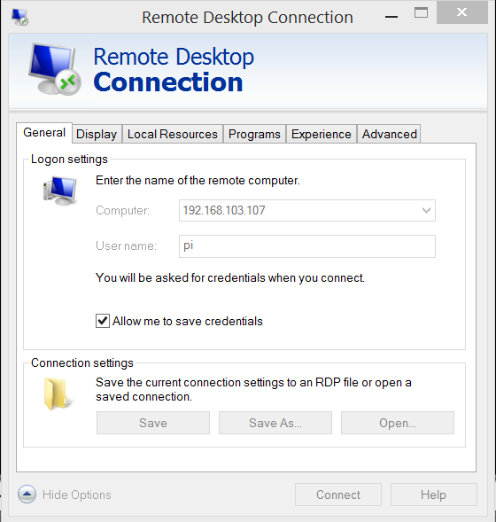    |  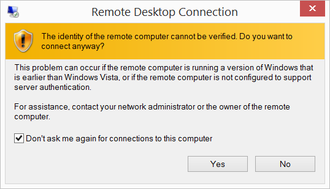  |  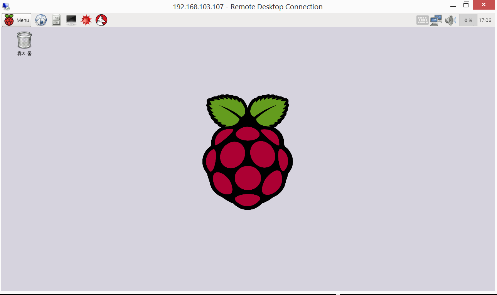  | 

원격 데스크톱 서비스를 이용할 수 있는 다양한 방법이 있다.
[Xming](http://www.raspians.com/knowledgebase/?knowledgebase=setting-up-a-remote-desktop-view-the-pi-on-your-windows-pc/), [VNC](https://www.raspberrypi.org/documentation/remote-access/vnc/)를 사용하여 `mstsc` 원격 데스크톱 연결과 같은 효과를 낼 수 있다. 

#### 1.2. 명령라인 인터페이스 CLI를 통한 방법

__Git Bash__를 설치하고 콘솔에서 라즈베리 파이 IP를 입력한다. 명령어는 `ssh pi@192.168.103.107`으로 ssh (보안쉘, Secure Shell)로 `192.168.103.107` IP를 갖는 호스트 컴퓨터에 `pi`사용자로 로그인한다.
비밀번호는 `raspberry`를 입력하면 라즈베리파이에 로그인했다.

~~~ {.input}
admin@STATKCLEE /c/pyr-cloudlayer (gh-pages)
$ ssh pi@192.168.103.107
pi@192.168.103.107's password:
Linux raspberrypi 3.18.11-v7+ #781 SMP PREEMPT Tue Apr 21 18:07:59 BST 2015 armv7l

The programs included with the Debian GNU/Linux system are free software;
the exact distribution terms for each program are described in the
individual files in /usr/share/doc/*/copyright.

Debian GNU/Linux comes with ABSOLUTELY NO WARRANTY, to the extent
permitted by applicable law.
Last login: Thu Jul 30 16:59:13 2015 from 192.168.103.125
pi@raspberrypi ~ $
~~~

#### 1.3. 웹 인터페이스를 통한 방법

라즈베리파이를 웹서버로 만들기 위해서 아파치 웹서버를 설치한다. `sudo apt-get install -y apache2` 명령어를 콘솔에서 입력하면 아파치 웹서버가 설치되어 웹브라우져를 통해 라즈베리파이에 접근할 수 있다.

~~~ {.input}
pi@raspberrypi ~ $ sudo apt-get install -y apache2
~~~

`/var/www/` 폴더에 `index.html` 파일을 수정하거나 개발된 웹서비스를 웹서비스 제공 디렉토리에 저장하면 된다.

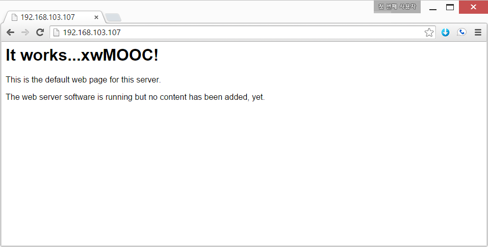

### 2.  클라우드 환경 그래픽 사용자 인터페이스(GUI), xrdp

클라우드에 가상컴퓨터를 생성한 뒤에 데스크탑 환경을 설치하고 VNC 원격 데스크탑 혹은 [XRDP](http://www.xrdp.org/)를 사용해서 윈도우와 마찬가지로 그래픽 사용자 인터페이스를 이용한다.

~~~ {.input}
sudo apt-get install ubuntu-desktop
sudo apt-get install xrdp
sudo /etc/init.d/xrdp start
~~~

원격 컴퓨터에 우분투 데스크탑 환경을 설치하고 나서 XRDP도 이어서 설치한다.
설치가 완료되면 XRP 응용프로그램을 실행한다.

~~~ {.input}
sudo adduser gildong sudo
~~~

윈도우 `원격 데스크톱연결`을 사용하기 전에 `root`가 아닌 사용자를 `gildong`으로 생성하고 `sudo` 권한도 부여한다.

~~~ {.input}
su gildong
echo "gnome-session --session=ubuntu-2d" > .xsession
~~~

`gildong` 사용자 세션 환경을 지정한다. `nano` 편집기를 사용해서 내용을 `.xsession` 파일에 저장해도 된다.

윈도우에서 클라우드 우분투 가상컴퓨터에 로그인 하기 이해서 `시작` -> `실행`을 클릭하고 `mstsc`를 입력하여 
`원격 데스크톱연결`을 실행한다.

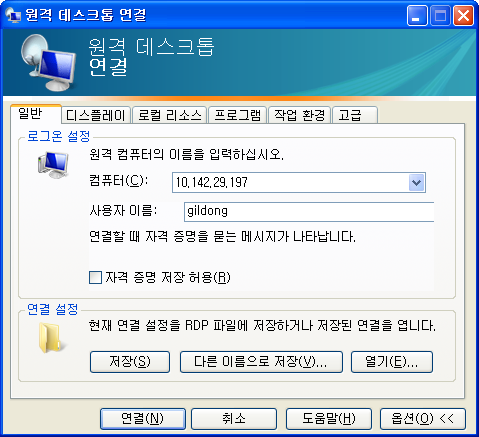

마지막으로 XRDP 로그인 화면이 나오고 비밀번호를 넣게 되면 그래픽 사용자 인터페이스를 원격 컴퓨터에서 이용하게 된다.

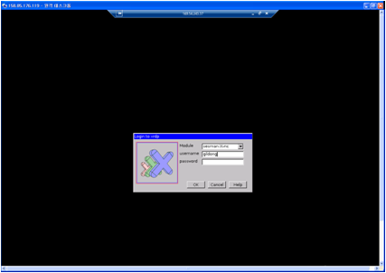

우분투 14.04로 버젼이 올라가면서 `XRDP` 속도도 좋지 못하고 부정적인 면이 많아서 **VNC** 데스크톱 GUI 설정을 사용하기 바란다. 

> ## 명령라인 인터페이스 {.callout}
>
> 지금 대부분의 사람들이 사용하는 그래픽 사용자 인터페이스(GUI, graphical user interface)과 구별하기 위해서 
> 명령라인 인터페이스(CLI, command-line interface)라고 한다. 
> CLI의 핵심은 읽기-평가-출력(REPL,read-evaluate-print loop이다. 사용자가 명령어를 타이핑하고 엔터(enter)/반환(return)키를 입력하면, 
> 컴퓨터가 일고, 실행하고, 결과를 출력한다. 그러면 사용자는 다른 명령를 타이핑하는 것을 로그 오프할때까지 계속한다.

#### 2.1. VNC 그래픽 사용자 인터페이스(GUI)

[VNC(Virtual Network Computing, 가상 네트워크 컴퓨팅)](http://ko.wikipedia.org/wiki/VNC)는 컴퓨터 환경에서 RFB 프로토콜을 이용하여 원격으로 다른 컴퓨터를 제어하는 그래픽 데스크톱 공유 시스템이다. 자판과 마우스 이벤트를 한 컴퓨터에서 다른 컴퓨터로 전송시켜서 네트워크를 거쳐 그래픽 화면을 갱신하는 방식을 제공한다.

#### 2.2. VNC 설치 및 환경설정

[How to install and configure VNC on Ubutun 14.04](https://www.digitalocean.com/community/tutorials/how-to-install-and-configure-vnc-on-ubuntu-14-04)를 참조했고, `SSL 터널(SSL Tunnel)` 기술과 클라이언트로 [TightVNC](http://www.tightvnc.com/)를 사용했다.
`SSL 터널`을 사용하는 이유는 비밀번호가 네트워크를 타고 공개되는 것을 방지하기 위함이다.

`slcli vs list` 명령어를 통해서 IP 주소 `169.53.232.4`으로 VNC GUI 설치를 위해 가상 컴퓨터가 생성된 것을 확인한다.

~~~ {.input}
root@shiny:~# slcli vs list
~~~

~~~ {.output}
:.........:............:.................:................:............:........:
:    id   :  hostname  :    primary_ip   :   backend_ip   : datacenter : action :
:.........:............:.................:................:............:........:
: 9686489 :    vnc     :   169.53.232.4  : 10.121.149.26  :   dal09    :   -    :
:.........:............:.................:................:............:........:
~~~

##### 2.2.0. 사전 준비 사항
1. 우분투 14.04 버젼을 준비한다.
2. `root` 권한을 갖는 사용자를 등록한다.

**우분투 14.04 버젼**

가상 컴퓨터를 생성했을 때 확인을 했지만, 다시 한번 `lsb_release -a` 명령어를 통해서 현재 운영체제 및 버젼을 확인한다. 

~~~ {.input}
root@vnc:~# lsb_release -a
~~~

~~~ {.output}
No LSB modules are available.
Distributor ID: Ubuntu
Description:    Ubuntu 14.04.2 LTS
Release:        14.04
Codename:       trusty
~~~

> ## 우분투 시스템 정보 {.callout}
>
> `uname -a` 명령어를 통해서 현재 운분투 시스템 정보를 자세히 확인한다.
> 

~~~ {.output}
  -a, --all                
                           
  -s, --kernel-name      :  Linux 
  -n, --nodename         :  vnc 
  -r, --kernel-release   :  3.13.0-51-generic 
  -v, --kernel-version   :  #84-Ubuntu SMP Wed Apr 15 12:08:34 UTC 2015
  -m, --machine          :  x86_64 
  -p, --processor        :  x86_64 
  -i, --hardware-platform:  x86_64 
  -o, --operating-system :  GNU/Linux
~~~

**`root` 권한을 갖는 사용자 등록**

루트 권한을 갖는 사용자를 준비하기 위해서 먼저 일반 사용자를 등록하고 등록된 사용자에 루트권한을 부여한다. `adduser xwmooc` 명령어를 통해서 `xwmooc` 사용자를 등록했다. 그리고 나서 `gpasswd -a xwmooc sudo` 명령어로 `sudo` 그룹에 등록해서 루트권한을 부여했다.

`su - xwmooc` 명령어를 통해서 루트가 아닌 일반사용자로 로그인했다.

~~~ {.input}
root@vnc:~# adduser xwmooc
Adding user `xwmooc' ...
Adding new group `xwmooc' (1000) ...
Adding new user `xwmooc' (1000) with group `xwmooc' ...
Creating home directory `/home/xwmooc' ...
Copying files from `/etc/skel' ...
Enter new UNIX password:
Retype new UNIX password:
passwd: password updated successfully
Changing the user information for xwmooc
Enter the new value, or press ENTER for the default
        Full Name []: xwMOOC
        Room Number []:
        Work Phone []:
        Home Phone []:
        Other []:
Is the information correct? [Y/n] Y
~~~

~~~ {.input}
root@vnc:~# gpasswd -a xwmooc sudo
Adding user xwmooc to group sudo
root@vnc:~# su - xwmooc
xwmooc@vnc:~$
~~~

##### 2.2.1. 데스크탑(바탕화면) 환경과 VNC 서버 설치

**XFCE4 GUI 설치**
기본설정으로 리눅스 서버 대부분은 GUI가 없이 설치된다.
따라서 가장 많은 사용자에게 익숙한 *XFCE4*를 설치한다.
*XFCE4*와 *TightVNC*도 함께 설치한다. 설치 원문은 [웹사이트](https://www.digitalocean.com/community/tutorials/how-to-install-and-configure-vnc-on-ubuntu-14-04)를 참조한다.

~~~ {.input}
xwmooc@vnc:~$ sudo apt-get update
xwmooc@vnc:~$ sudo apt-get install xfce4 xfce4-goodies tightvncserver
~~~

**우분투 데스크톱 GUI 설치**

*ubuntu-desktop*과 *TightVNC*도 함께 설치한다. 설치 원문은 [웹사이트](http://www.htpcbeginner.com/install-gui-on-ubuntu-server-14-04-gnome/)를 참조한다.

~~~ {.input}
xwmooc@vnc:~$ sudo apt-get -y install xorg gnome-core gnome-system-tools gnome-app-install
xwmooc@vnc:~$ sudo apt-get -y install --no-install-recommends ubuntu-desktop
xwmooc@vnc:~$ sudo apt-get -y install tightvncserver
~~~

`vncserver` 명령어로 보안 비밀번호를 설정한다.`vncserver` 비밀번호는 6자리 이상입력해야 한다. 그리고 `**view-only** password`를 설정할 때 `y`로 설정하면 마우스나 키보드로 제어권한이 없기 때문에 시연이나 보여주기 용도로 사용하면 적절하다.

~~~ {.input}
xwmooc@vnc:~$ vncserver
~~~

~~~ {output}
You will require a password to access your desktops.

Password:
Password too short
~~~

~~~ {.input}
xwmooc@vnc:~$ vncserver
~~~

~~~ {.output}
You will require a password to access your desktops.

Password:
Verify:
Would you like to enter a view-only password (y/n)? n
xauth:  file /home/xwmooc/.Xauthority does not exist

New 'X' desktop is vnc:1

Creating default startup script /home/xwmooc/.vnc/xstartup
Starting applications specified in /home/xwmooc/.vnc/xstartup
Log file is /home/xwmooc/.vnc/vnc:1.log
~~~

##### 2.2.2. VNC 서버 환경설정

VNC가 처음 설정될 때, 포트번호 5901에 기본 서버 인스턴스가 올라간다.
5901 포트는 화면출력(display) 포트로 알려있고, VNC는 `:1`로 참조하다. `:2`, `:3` 처럼 다른 화면출력 포트에 인스턴스를 다수 올릴 수 있다. VNC 서버로 작업할 때, `:X`는 `5900+X`를 참조하는 화면출력 포트라는 것을 기억한다.

가장 먼저 `vncserver -kill :1` 명령어로 `5901` 포트에 실행되는 인스턴스를 정지시킨다. 새로운 VNC 시작 환경설정 파일을 작성하기 앞서 `mv ~/.vnc/xstartup ~/.vnc/xstartup.bak` 명령어로 백업한다.
그리고 나서 `nano ~/.vnc/xstartup` 나노 편집기를 열어서 다음 내용을 추가한다.

**xfce**
~~~ {.input}
#!/bin/bash
xrdb $HOME/.Xresources
startxfce4 &
~~~

**Ubuntu Trusty Tahr 14.04LTS**

우분투 데스크톱 GUI에 대한 자세한 설정 사항은 다음 [웹사이트](http://www.havetheknowhow.com/Configure-the-server/Install-VNC.html)를 참조한다. `nano ~/.vnc/xstartup` 편집을 다음과 같이 한다.

~~~ {.input}
#!/bin/sh

# Uncomment the following two lines for normal desktop:
unset SESSION_MANAGER
# exec /etc/X11/xinit/xinitrc

#[ -x /etc/vnc/xstartup ] && exec /etc/vnc/xstartup
#[ -r $HOME/.Xresources ] && xrdb $HOME/.Xresources
#xsetroot -solid grey
#vncconfig -iconic &
#x-terminal-emulator -geometry 80x24+10+10 -ls -title "$VNCDESKTOP Desktop" &
#x-window-manager &

metacity &
gnome-settings-daemon &
gnome-panel & 
~~~

`xrdb $HOME/.Xresources` 명령어는 터미널 색깔, 테마, 폰트 등 데스트톱 그래픽 인터페이스 설정을 담고 있는 `$HOME/.Xresources` 파일 정보를 VNC GUI 프레임워크가 읽어온다.

`startxfce4 &` 명령어는 XFCE를 실행시켜 필요한 모든 그래픽 소프트웨어를 띄운다.

`sudo chmod +x ~/.vnc/xstartup` 명령어로 `xstartup` 파일에 실행권한을 부여한다.

~~~ {.input}
xwmooc@vnc:~$ vncserver -kill :1
Killing Xtightvnc process ID 14168
xwmooc@vnc:~$ mv ~/.vnc/xstartup ~/.vnc/xstartup.bak
xwmooc@vnc:~$ nano ~/.vnc/xstartup
xwmooc@vnc:~$ sudo chmod +x ~/.vnc/xstartup
~~~

##### 2.2.3. VNC 서비스 파일 생성

VNC 서버를 제어하는데 필요한 환경설정을 한다. 이를 통해서 VNC 서버를 필요에 따라 시작(start), 정지(stop), 재시작(restart) 동작을 쉽게 한다.

먼저 나노 편집기로 `sudo nano /etc/init.d/vncserver` 파일을 열어 다음 내용 추가한다.

`export USER="xwmooc"`에 앞에서 생성한 `root` 권한을 갖는 사용자명을 집어넣는다. `GEOMETRY="1024x768"` 화면 해상도를 설정한다.
`start)`,`stop)`, `restart)`는 VNC 서버 시작, 중지, 재시작에 필요한 제어 명령이다.

~~~ {.input}
#!/bin/bash
PATH="$PATH:/usr/bin/"
export USER="xwmooc"
DISPLAY="1"
DEPTH="16"
GEOMETRY="1280x1024"
OPTIONS="-depth ${DEPTH} -geometry ${GEOMETRY} :${DISPLAY} -localhost"
. /lib/lsb/init-functions

case "$1" in
start)
log_action_begin_msg "Starting vncserver for user '${USER}' on localhost:${DISPLAY}"
su ${USER} -c "/usr/bin/vncserver ${OPTIONS}"
;;

stop)
log_action_begin_msg "Stopping vncserver for user '${USER}' on localhost:${DISPLAY}"
su ${USER} -c "/usr/bin/vncserver -kill :${DISPLAY}"
;;

restart)
$0 stop
$0 start
;;
esac
exit 0
~~~

VNC 서비스 환경설정을 파일을 생성했으니, `sudo chmod +x /etc/init.d/vncserver` 실행화일로 권한을 부여하고, `sudo service vncserver start` 명령어로 서비스를 시작한다.

~~~ {.input}
xwmooc@vnc:~$ sudo nano /etc/init.d/vncserver
xwmooc@vnc:~$ sudo chmod +x /etc/init.d/vncserver
xwmooc@vnc:~$ sudo service vncserver start
~~~

~~~ {.output}
 * Starting vncserver for user 'xwmooc' on localhost:1...
}
New 'X' desktop is vnc:1

Starting applications specified in /home/xwmooc/.vnc/xstartup
Log file is /home/xwmooc/.vnc/vnc:1.log
~~~

##### 2.2.4. VNC 데스크톱(바탕화면)에 연결

VNC 서버 환경설정이 모두 마무리 되었고, 이제 SSH 터널을 통해 VNC 연결할 클라이언트를 설정한다. 윈도우에서는 [TightVNC](http://www.tightvnc.com/download.php), [RealVNC](https://www.realvnc.com/), [UltraVNC](http://www.uvnc.com/) 등 다양한 VNC 클라이언트가 있다. 맥에서는 내장된 `Screen Sharing`을 사용한다. 

#### 2.3. VNC 데스크톱(바탕화면) 문제 해결

가상 컴퓨터에서 제공하는 VNC 서버 기능을 사용하다보면 첫 연결을 되지만 두번째 세번째 연결에 실패하는 경우가 많다. 이런 경우 `vncserver restart` 기능을 사용해서 다시 처음처럼 연결한다. `sudo service vncserver restart` 명령어를 통해 다시 정상적으로 원격 데스크톱 VNC 서비스를 제공한다. 

~~~ {.input}
xwmooc@dev-hangul:/root$ sudo service vncserver restart
~~~

~~~ {.output}
 * Stopping vncserver for user 'xwmooc' on localhost:1...

Can't find file /home/xwmooc/.vnc/dev-hangul:1.pid
You'll have to kill the Xtightvnc process manually

 * Starting vncserver for user 'xwmooc' on localhost:1...

New 'X' desktop is dev-hangul:1

Starting applications specified in /home/xwmooc/.vnc/xstartup
Log file is /home/xwmooc/.vnc/dev-hangul:1.log
~~~ 

`vncserver restart`를 시작하기 전에 만약 이전에 프로세스가 떠있으면 오류가 날 수 있으니 `ps aux` 명령어로 프로세스를 확인하고 `kill -9` 명령어로 `vnc` 서비스를 종료하고 깔끔하게 다시 시작한다. 다음에서 *14780*은 `ps aux`를 통해서 확인한 PID다.

~~~ {.input}
xwmooc@dev-hangul:/root$ ps aux | grep vnc
xwmooc@dev-hangul:/root$ kill -9 14780
~~~

> ### Git for Windows {.callout}
> 
> 윈도우 환경에서 유닉스 배쉬(Bash) 명령라인 인터페이스를 사용하는데 최근에는 `Git Bash`를 많이 사용한다.
> [Git Bash](https://msysgit.github.io/)를 설치하고 윈도우 탐색기를
> 열고 특정 폴더에서 마우스 오른쪽 클릭하게 되면 **Git Bash**
> 메뉴가 뜨고 이를 클릭하면 유닉스 명령어를 윈도우 상에서 실행하게 된다. 

먼저, 로컬 컴퓨터에 SSH 연결을 해서 VNC에 대한 `localhost`에 보안 포워딩을 한다. 이를 실행하는 명령어는 다음과 같다. 리눅스나 OS X 터미널에서 `ssh -L 5901:127.0.0.1:5901 -N -f -l` 명령어는 공통이고 루트 권한을 갖는 사용자 `xwmooc`, 연결하려는 가상컴퓨터/호스트 IP 주소 `169.53.232.4`를 입력한다.

~~~ {.input}
$ ssh -L 5901:127.0.0.1:5901 -N -f -l xwmooc 169.53.232.4
~~~

~~~ {.output}
The authenticity of host '169.53.232.4 (169.53.232.4)' can't be established.
ECDSA key fingerprint is 13:85:c8:a9:af....
Are you sure you want to continue connecting (yes/no)? yes
Warning: Permanently added '169.53.232.4' (ECDSA) to the list of known hosts.
Password:
~~~

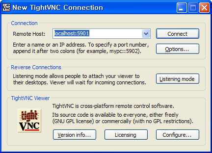

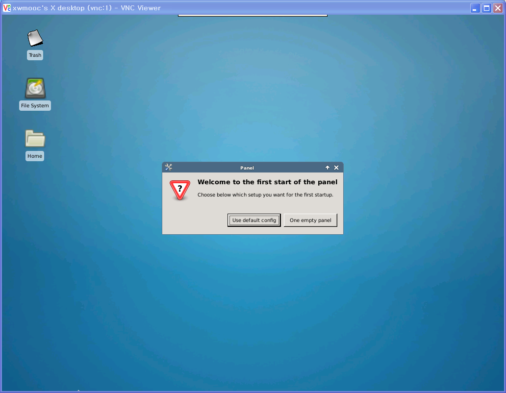

**WARNING: REMOTE HOST IDENTIFICATION HAS CHANGED!**

VNC 클라이언트에서 SSH 터널 연결을 위해 `ssh -L 5901:127.0.0.1:5901 -N -f -l xwmooc 169.53.232.4` 명령어를 던질 때 다음과 같은 오류가 발생될 수 있다.

~~~ {.input}
$ ssh -L 5901:127.0.0.1:5901 -N -f -l xwmooc 169.53.232.4
~~~ 
~~~ {.output}
@@@@@@@@@@@@@@@@@@@@@@@@@@@@@@@@@@@@@@@@@@@@@@@@@@@@@@@@@@@
@    WARNING: REMOTE HOST IDENTIFICATION HAS CHANGED!     @
@@@@@@@@@@@@@@@@@@@@@@@@@@@@@@@@@@@@@@@@@@@@@@@@@@@@@@@@@@@
IT IS POSSIBLE THAT SOMEONE IS DOING SOMETHING NASTY!
Someone could be eavesdropping on you right now (man-in-the-middle attack)!
It is also possible that a host key has just been changed.
The fingerprint for the ECDSA key sent by the remote host is
13:85:c8:a9:af:2c:ce:e8:8e:3d:3f:4c:ee:07:06:13.
Please contact your system administrator.
Add correct host key in /c/XXX/XXXX/.ssh/known_hosts to get rid of this message.
Offending ECDSA key in /c/XXX/XXXX/.ssh/known_hosts:9
ECDSA host key for 169.53.232.4 has changed and you have requested strict checking.
Host key verification failed.
~~~

당황하지 말고, 다음과 같이 `trouble shooting`한다. `ssh-keygen -R` 명령어 인자로 `169.53.232.4` IP 주소를 입력한다. 

~~~ {.input}
$ ssh-keygen -R 169.53.232.4
~~~ 

~~~ {.output}
# Host 169.53.232.4 found: line 9 type ECDSA
/c/XXX/XXXX/.ssh/known_hosts updated.
Original contents retained as /c/XXX/XXXX/.ssh/known_hosts.old
~~~

### 3. 원격 컴퓨터 접속 (CLI)

**출처: 소프트웨어 카펜트리 원격 접속(Working Remotely) 한국어 번역**

일반 PC와 노트북 컴퓨터를 사용할 때 무슨 일이 발생하는지 좀더 자세히 살펴보자.
첫번째 단계는 컴퓨터에 로그인(login)한다. 그러면 운영체계(Operating System, OS)가 사용자가 누구인지 확인하고 무슨 작업을 허락할 것이지 준비한다.
사용자 이름과 비밀번호를 입력해서 상기 작업을 수행한다; 운영체제가 시스템 레코드 값을 확인하고, 만약 일치한다면 사용자를 위해 쉘(Shell)을 실행한다.

명령어를 타이핑할 때, 타이핑하는 문자를 표현하는 0과 1이 키보드에서 쉘로 전송된다. 쉘은 화면에 사용자가 타이핑하는 것을 화면에 출력한다. 그리고 나서, 만약 타이핑한 것이 명령어라면, 쉘이 실행을 하고 나서 (출력 결과가 있다면) 산출결과를 화면에 출력한다.

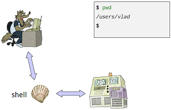
그림: 직접 쉘 사용하는 방법

실험결과 데이터베이스를 관리하는 지하실 서버같은 또다른 컴퓨터에 명령어를 실행하고자 한다면 어떨까? 이를 위해서, 먼저 해당 컴퓨터에 로그인해야 한다.
이를 **원격 로그인(remote login)**이라고 부르고, 해당 컴퓨터를 원격 컴퓨터(remote machine)라고 한다.
원격 로그인하게 되면, 타이핑하는 모든 것은 원격 컴퓨터에서 실행되고 있는 쉘에 전달된다. 쉘과 상호작용(interact)하면 마치 로컬 컴퓨터 쉘과 마찬가지로 명령어를 실행하게 된다. 그러고 나면, 로컬 컴퓨터 화면에 출력결과를 표시해준다.

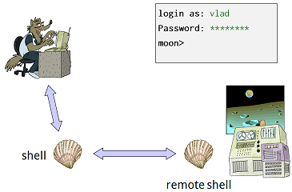
그림: 원격 쉘 사용하는 방법

원격 로그인하는데 사용하는 도구가 **시큐어 쉘(secure shell, SSH)**이다. 특히, `ssh username@computer` 명령어는 SSH를 실행하고 사용자가 지정한 원격 컴퓨터에 접속한다.
로그인한 후에는 원격쉘을 사용해서 원격 컴퓨터에 있는 파일과 디렉토리를 사용한다. `exit`을 타이핑하거나 컨트롤+D(`CTRL+D`)를 누르게 되면, 원격 쉘을 종료하고 이전 쉘로 돌아온다. 
다음 예제에서, 원격쉘과 상호작용이 나타나 있다. 또한, `$` 대신에 원격 컴퓨터 명령 프롬프트가 `moon>`임을 볼 수 있고 Vlad가 비밀번호를 기억하려고 몇번 시도한 것도 나타나 있다.

~~~ {.input}
$ pwd
/users/vlad

$ ssh vlad@moon
Password: ***
Access denied
Password: ********
moon> pwd
/home/vlad
moon> ls -F
bin/     cheese.txt   dark_side/   rocks.cfg
moon> exit

$ pwd
/users/vlad
~~~

시큐어쉘은 이전 `rsh`로 불리는 프로그램과 대조되게 "시큐어(secure)"로 불린다. 옛날에 모든 사람이 서로를 신뢰했고 이름만으로 컴퓨터에 있는 모든 정보를 알고 있었을 때, 네트워크를 통해서 전송할 때 가장 민감한 정보를 제외하고 어떤것도 암호화하지 않았다. 하지만, 이와 같은 방식이 의미하는 것이 악한이 네트워크 통신을 지켜볼 수 있고, 사용자 이름과 비밀번호를 훔칠 수도 있고, 악의적인 방식으로도 사용할 수 있다는 것이다.
SSH가 발명되어 이런 부정적인 면을 방지하거나 적어도 늦출 수도 있다.
SSH는 몇가지 정교하며 오랜 기간 테스트된 암화화 프로토콜을 사용해서 외부인이 서로다른 두 컴퓨터 사이에 오고가는 메시지 내용을 볼 수 없게 확실히 한다.
추후 SSH가 동작하는 방식을 논하고 실제로 얼마나 보안이 좋은지 살펴본다. 

`ssh`는 `scp`라는 짝꿍 프로그램이 있는데 "보안 복사(Secure Copy)"를 표현하는 명령어다. SSH와 동일한 유형의 네트워크 연결을 사용해서, 
원격 컴퓨터로 혹은 원격 컴퓨터로부터 파일을 복사할 수 있게 한다.
구문(syntax)은 `cp`와 `ssh`를 섞은 것이다.
파일을 복사하기 위해서, 원천(source)과 목표(destination) 경로를 지정하는데 컴퓨터 이름을 포함할 수도 있다. 만약 컴퓨터 이름을 생략하면, 
`ssh`는 지금 실행되고 있는 컴퓨터를 의미한다고 가정한다.
예를 들어, 다음 명령어는 가장 최근 실험결과 (results.dat)를 지하실 백업서버에 복사한다. 복사할 때, 진행경과가 화면에 출력된다.

~~~ {.input}
$ scp results.dat vlad@backupserver:backups/results-2011-11-11.dat
Password: ********
results.dat              100%  9  1.0 MB/s 00:00
~~~

전체 디렉토리를 복사하는 것도 유사하다: `-r` 옵션을 사용해서 복사를 재귀적으로 수행하고 싶다고 신호를 전달하면 된다.
예를 들어, 다음 명령어는 백업 서버에서 모든 작업결과물을 사용자 노트북으로 복사한다. 

~~~ {.input}
$ scp -r vlad@backupserver:backups ./backups
Password: ********
results-2011-09-18.dat              100%  7  1.0 MB/s 00:00
results-2011-10-04.dat              100%  9  1.0 MB/s 00:00
results-2011-10-28.dat              100%  8  1.0 MB/s 00:00
results-2011-11-11.dat              100%  9  1.0 MB/s 00:00
~~~

이제 백업서버에 `backups/results-2011-11-12.dat` 파일을 이미 생성했는지 확인하고자 한다고 가정하자. 
로그인하고 난 다음에 `ls`를 타이핑하는 대신에 다음과 같이 동일한 것을 수행한다.

~~~ {.input}
$ ssh vlad@backupserver ls results
Password: ********
results-2011-09-18.dat  results-2011-10-28.dat
results-2011-10-04.dat  results-2011-11-11.dat
~~~

SSH는 사용자 이름과 실행하려고 하는 컴퓨터 이름 뒤에 인자를 받아서 원격 컴퓨터에 있는 쉘에 명령어를 전달한다. 상기 전달 인자가 적합한 명령어이기 때문에, 원격 쉘이 사용자를 대신해서 `ls results`을 실행하고 실행결과를 다시 로컬 쉘에 화면출력한다.

#### 3.1. 열쇠(키) 생성과 관리 

원격 컴퓨터에 접속할 때마다 비밀번호를 매번 타이핑하는 것은 사소한 성가심 이상이다. 만약 원격 컴퓨터에 세가지 다른 매개변수 조합을 갖는 프로그램을 실행하고자 한다면 무슨 일이 발생할지 상상해보라.
다음과 같은 것을 수행하고자 한다.

~~~ {.input}
for density in {20..29}
do
  for viscosity in 0.70 0.71 0.72 0.73 0.74
  do
    for temperature in 0.001 0.002 0.003 0.004 0.005
    do
      ssh vlad@fastmachine ./simulation -x -d $density -v $viscosity -v $temperature
    done
  done
done
~~~

하지만, 상기 작업을 사실상 수행하고자 한다면, 자리에 앉아서 키보드로 비밀번호를 250번 타이핑해야 할 것이다.
원하는 바는 자동으로 원격 컴퓨터에 인증하는 방법을 찾는 것이다.

*공개 열쇠 암호화(public key cryptography)* 방식에서 가져온 기술을 사용해서 상기 문제를 해결할 수 있다. 좀더 구체적으로, *공개 열쇠(public key)*와 *개인 열쇠 (private key)*로 구성된 *열쇠 쌍(key pair)*을 생성한다. 이렇게 생성된 열쇠는 두가지 흥미로운 특성이 있다:

1.  어느 한 열쇠가 암호화한 것은 다른 열쇠가 암호를 풀 수 있다. 예를 들어, 만약 개인 열쇠로 비밀번호를 암호화했다면, 해당 공개 열쇠만 암호를 풀 수 있다. 만약 공개 열쇠로 파일 내용을 암호화했다면, 상응하는 개인 열쇠만 암호를 풀 수 있다. 
2.  한 열쇠가 주어진 상태에서, 다른 열쇠를 찾는 것은 실질적으로 불가능하다. 여기서 "실질적으로 불가능"하다는 의미는 "우리가 마음속으로 상상하는 어떤 컴퓨터를 사용해서 우주 기대수명내에 풀 수는 없다"는 것이다.
(하지만, 양자컴퓨팅이 하루만에 이것을 바꿀 수도 있다-자세한 내용은 근처 다소 몽상적인 물리학자와 상의하세요.)

열쇠쌍을 생성하게 되면, 접속하려는 원격 컴퓨터에 공개 열쇠를 저장하고, 
로컬 컴퓨터에 개인 열쇠를 보관한다. 
SSH는 열쇠가 예상하는 곳에 놓기만 하면, 비밀번호를 묻는 대신에 열쇠를 사용한다.

첫번째 단계는 열쇠쌍을 생성하는 것인데, `ssh-keygen`을 사용해서 열쇠쌍을 생성한다.

~~~ {.input}
$ ssh-keygen -t rsa
Generating public/private rsa key pair.
Enter file in which to save the key (/users/vlad/.ssh/id_rsa): ↵
Enter passphrase (empty for no passphrase): ↵
Your identification has been saved in /users/vlad/.ssh/id_rsa.
Your public key has been saved in /users/vlad/.ssh/id_rsa.pub.
The key fingerprint is: d3:1a:27:38:aa:54:e8:a5:03:db:79:2f:b2:c3:c9:3d
~~~

`-t rsa` 옵션은 `ssh-keygen`에게 RSA키 열쇠를 생성하게 한다; 다른 유형도 있지만, 가장 흔하게 사용되는 것이다. 
"↵" 문자는 복귀(carriage return, CR) 문자다: 기본설정된 디폴트 장소에 열쇠를 저장한다는 것으로 SSH가 열쇠를 어디서 찾는지 알게 되고, 패스프레이즈(passphrase)도 원하지 않는다(패스프레이즈를 원치 않는 이유는 패스워드를 타이핑하지 않고 로그인하는 것이 요점이기 때문이다). 그래서, 두 질문에 단지 엔터만 치게된다.  

홈 디렉토리 아래 `.ssh` 디렉토리 내부를 살펴보자.

~~~ {.input}
$ cd
$ ls .ssh
id_rsa  id_rsa.pub
~~~

첫번째 `id_rsa` 파일은 개인 열쇠 정보를 담고 있다.
절대 원격 컴퓨터에 저장하거나, 전자우편으로 전송하거나,
다른 누구와도 공유하지 마라. (타인이 당신을 가장하여 무언가 수행하는 것을 정말 원하지 않는다면) 다른 파일 `id_rsa.pub`은 매칭되는 공개 열쇠 정보를 담고 있다. 이 파일을 복사해서 접속하려는 원격 컴퓨터에 복사한다.

~~~ {.input}
$ scp .ssh/id_rsa.pub vlad@fastmachine:id_rsa.pub
Password: ********
id_rsa.pub              100%  1  1.0 MB/s 00:00
~~~

여전히 비밀번호를 타이핑해야 하는데 이유는 공개 열쇠가 `scp`를 실행할 때 원격 컴퓨터에 올바른 장소에 위치하지 않아서 그렇다.
원격 컴퓨터에 로그인해서 `.ssh` 디렉토리를 거기에 생성해서 문제를 해결해보자.

~~~ {.input}
$ ssh vlad@fastmachine
Password: ********

$ mkdir .ssh
~~~

다음 단계는 공개 열쇠를 `authorized_keys`로 불리는 `.ssh` 디렉토리에 파일로 복사한다:

~~~ {.input}
$ cp id_rsa.pub .ssh/authorized_keys
~~~

마지막 단계는 권한이 적절하게 `.ssh` 와 `authorized_keys`에 설정되었는지 확실히 한다. 이것은 추가적인 보안 안전 조치다:
만약 사용자를 제외한 타인이 읽거나 변경한다면,
SSH는 더 이상 보안이 확실하지 않다고 가정한다. 올바른 권한은 다음과 같다:

*   소유자(Owner)는 `.ssh` 디렉토리에 읽기, 쓰기, 실행 권한을 갖는다.
*   소유자는 `.ssh/authorized_keys`에 대해서 읽기, 쓰기 권한을 갖는다.
*   그밖의 누구도 어떤 권한을 갖지 않는다.

올바른 명령어는 다음과 같다:

~~~ {.input}
$ chmod u=rwx,g=,o= .ssh
$ chmod u=rw,g=,o= .ssh/authorized_keys
~~~

이제 모든 권한 설정이 되었다. 원격쉘에서 빠져나와 모든 것이 정상적으로 동작하는지 살펴보기 위해서 다음 명령어를 실행한다:

~~~ {.input}
$ exit
$ ssh vlad@fastmachine pwd
/home/vlad
~~~

열쇠를 생성하고 설치한 뒤에 두 컴퓨터 모습이 다음에 나와 있다.

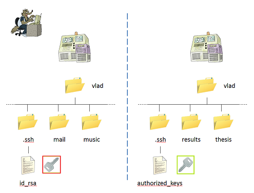

이제 매번 비밀번호 인증절차를 거치지 않고 로컬 컴퓨터에서 원격 컴퓨텅에 `ssh` (그리고 `scp`) 명령을 실행할 수 있다.
하지만, 상기 설정은 일방향으로만 동작한다:
원격 컴퓨터 `authorized_keys` 파일에 설치한 공개키가 사용자가 위치한 로컬 컴퓨터에 로그인 할 수 있는 권한을 부여한 것은 *아니다*.
만약 원격 컴퓨터에서 로컬 컴퓨터로 접속하려면, 원격 컴퓨터에서 열쇠쌍을 생성하고 `id_rsa.pub`을 로컬 컴퓨터 `authorized_keys` 파일로 복사한다.

만약 다른 여러대 컴퓨터에 접속하려면 어떨까? 예를 들어,
백업 서버에서 로컬 노트북 컴퓨터로, 데스크탑 PC로, 연구실 컴퓨터로, 혹은 반대로 파일을 복사한다고 가정하자.
이를 처리하기 위해서, 각 컴퓨터에 있는 `id_rsa.pub` 파일을 원격 컴퓨터 
`.ssh/authorized_keys` 파일에 추가한다. 편집기를 사용해서 수행하거나, 혹은 좀더 간단하게 `cat`과 `>>`을 사용해서 한 파일을 다른 파일에 덧붙인다. 

~~~ {.input}
$ scp id_rsa.pub vlad@backupserver
Password: ********

$ ssh vlad@backupserver
Password: ********

$ cat id_rsa.pub >> .ssh/authorized_keys

$ rm id_rsa.pub

$ exit
~~~

#### 3.2. 클라우드 리눅스 서버 접속

먼저 윈도 환경 `Git Bash`를 통해서 바로 `ssh-keygen -t rsa` 명령어를 입력해서 공개열쇠와 개인열쇠를 생성한다. 열쇠쌍은 `c:\Users\admin\.ssh\id_rsa`에 생성된다.

~~~ {.input}
$ ssh-keygen -t rsa
Generating public/private rsa key pair.
Enter file in which to save the key (/c/Users/admin/.ssh/id_rsa):
Enter passphrase (empty for no passphrase):
Enter same passphrase again:
Your identification has been saved in /c/Users/admin/.ssh/id_rsa.
Your public key has been saved in /c/Users/admin/.ssh/id_rsa.pub.
The key fingerprint is:
8d:09:...
admin@STATKCLEE
~~~

이제 클라우드 서비스 제공업체 가상컴퓨터에 접속한다. 디바이스 목록에서 `rstudio.xwmooc.net` 이름을 갖는 가상컴퓨터의 IP 주소 `169.54.243.36`에 로그인한다. 물론 비밀번호를 입력해야 한다.

~~~ {.input}
$ ssh root@169.54.243.36
The authenticity of host '169.54.243.36 (169.54.243.36)' can't be established.
RSA key fingerprint is df:0f....
Are you sure you want to continue connecting (yes/no)? Y
Please type 'yes' or 'no': yes
Warning: Permanently added '169.54.243.36' (RSA) to the list of known hosts.
root@169.54.243.36's password:
Linux rstudio 2.6.32-374-ec2 #91-Ubuntu SMP Wed Dec 10 11:07:16 UTC 2014 x86_64
GNU/Linux
Ubuntu 10.04.4 LTS

Welcome to Ubuntu!
 * Documentation:  https://help.ubuntu.com/
Last login: Wed Apr 29 02:33:51 2015 from 222.99.61.77
root@rstudio:~#
~~~

로컬 컴퓨터에 있는 `id_rsa.pub` 공개열쇠를 원격 컴퓨터에 복사한다.
복사를 위해서는 `scp` 명령어를 사용해서 원격 컴퓨터에 접속하고 복사 디렉토리로 홈디렉토리(`~`)를 설정한다. `id_rsa.pub` 파일이 원격컴퓨터 홈디렉토리에 복사된 것을 `ls` 명령어를 통해서 확인한다.

~~~ {.input}
$ scp id_rsa.pub root@169.54.243.36:~
root@169.54.243.36's password:
id_rsa.pub                                    100%  397     0.4KB/s   00:00

admin@STATKCLEE /C/Users/admin/.ssh
$ ssh root@169.54.243.36
root@169.54.243.36's password:
Linux rstudio 2.6.32-374-ec2 #91-Ubuntu SMP Wed Dec 10 11:07:16 UTC 2014 x86_64
GNU/Linux
Ubuntu 10.04.4 LTS

Welcome to Ubuntu!
 * Documentation:  https://help.ubuntu.com/
Last login: Fri May 15 02:00:26 2015 from 112.216.243.234
root@rstudio:~# ls
=               rstudio-0.98.1103-i386.deb          rubygems-1.3.7.tgz
id_rsa.pub      rstudio-server-0.98.1103-amd64.deb  rubygems-1.3.7.tgz.1
lesson-example  rubygems-1.3.7                      xwmooc-sc
root@rstudio:~#
~~~

원격 컴퓨터 홈디렉토리 밑에 하위디렉토로 `.ssh`를 생성한다.
`id_rsa.pub` 공개열쇠 파일을 `.ssh/authorized_keys` 파일로 복사한다.
그리고 추가적인 보안 설정을 위해서 `.ssh` 디렉토리와 `authorized_keys` 파일에 권한 설정을 하고 `exit`를 타이핑해서 원격 컴퓨터 접속을 끊는다.

~~~ {.input}
root@rstudio:~# mkdir .ssh
root@rstudio:~# cp id_rsa.pub .ssh/authorized_keys
root@rstudio:~# chmod u=rwx,g=,o= .ssh
root@rstudio:~# chmod u=rw,g=,o= .ssh/authorized_keys
root@rstudio:~# exit
logout
Connection to 169.54.243.36 closed.
~~~

이제 `ssh root@169.54.243.36` 명령어로 원격 컴퓨터에 접속한다. 패스워드를 타이핑 하지 않고 바로 로그인 된다. 마지막으로 `id_rsa.pub` 홈디렉토리에 원격 복사한 공개열쇠 파일을 삭제해서 마무리한다.

~~~ {.input}
admin@STATKCLEE /C/_software-carpentry/xwmooc-sc (reproducible)
$ ssh root@169.54.243.36
Linux rstudio 2.6.32-374-ec2 #91-Ubuntu SMP Wed Dec 10 11:07:16 UTC 2014 x86_64
GNU/Linux
Ubuntu 10.04.4 LTS

Welcome to Ubuntu!
 * Documentation:  https://help.ubuntu.com/
Last login: Fri May 15 02:06:05 2015 from 112.216.243.234
root@rstudio:~# ls
=               rstudio-0.98.1103-i386.deb          rubygems-1.3.7.tgz
id_rsa.pub      rstudio-server-0.98.1103-amd64.deb  rubygems-1.3.7.tgz.1
lesson-example  rubygems-1.3.7                      xwmooc-sc
root@rstudio:~# rm id_rsa.pub
~~~

동일한 방식으로 IP 주소 `169.54.243.37`을 갖는 `shiny.xwmooc.net` 가상 컴퓨터에도 접속해서 비밀번호를 입력하지 않고 접속하도록 한다.

