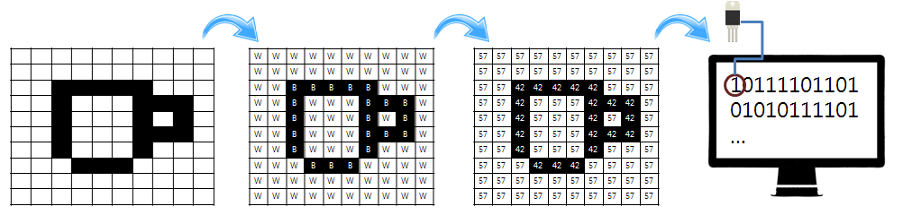

> ### 학습 목표 {.objectives}
>
> *  컴퓨터로 이미지를 표현한다.

### 이미지를 컴퓨터 숫자로 표현

- B는 흰색의 약자로 아스키 헥스 코드(16진수)로 42
- W는 검정색의 약자로 아스키 헥스 코드(16진수)로 57

- [참고: How do computers store images?](https://www.youtube.com/watch?v=EXZWHumclx0)