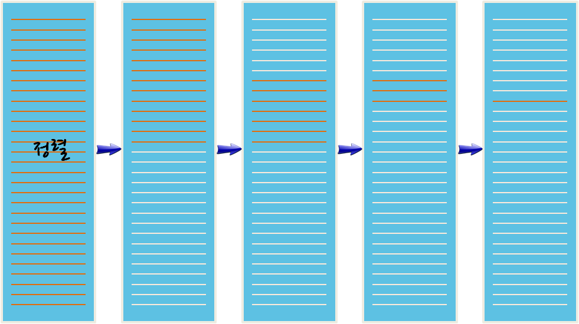

> ### 학습 목표 {.objectives}
>
> *  순차 검색의 장단점을 살펴본다.
> *  이진 검색을 이해한다.
> *  이진 검색 개념을 디버깅에 적용한다.

### 1. 순차 검색과 이진 검색

데이터가 주어진 경우 원하는 정보를 찾는 것이 일반적인 검색이다. 사용자가 찾는 정보를 제공하기 위해서 검색정보를 제공하는 서비스 제공자 입장에서 **순차 검색**(sequential search) 알고리즘을 생각해 볼 수 있다. 데이터에서 찾고자 하는 정보를 맨 앞에서부터 끝까지 순차대로 찾아 나가는 것이다. 검색 방법 중 가장 단순하여 구현이 쉽고 정렬되지 않은 데이터에서 정보를 찾을 수 있다.

**이진 검색**은 정렬된 데이터에서 처음과 끝의 중간을 임의 값으로 선택하여, 그 값과 찾고자 하는 정보의 크고 작음을 비교하는 방식이다. 처음 선택한 중앙값이 만약 찾는 정보값보다 크면 그 값은 새로운 최고값이 되며, 반대로 작으면 새로운 최하값이 된다. 정렬된 데이터에서만 사용되는 단점이 있지만, 목표 검색 정보를 빠르게 찾을 수 있는 장점도 있다.

### 2. 이분법을 활용한 디버깅 기법
 
좀더 큰 프로그램을 작성할 때, 좀더 많은 시간을 디버깅에 보내는 자신을 발견할 것이다. 좀더 많은 코드는 버그가 숨을 수 있는 좀더 많은 장소와 오류가 발생할 기회가 있다는 것을 의미한다.

디버깅 시간을 줄이는 한 방법은 **이분법에 따라 디버깅(debugging by bisection)** 하는 것이다. 예를 들어, 프로그램에 100 줄이 있고 한번에 하나씩 확인한다면, 100 번 단계가 필요하다.

대신에 문제를 반으로 나눈다. 프로그램 정확히 중간이나, 중간부분에서 점검한다. `print`문이나, 검증 효과를 갖는 상응하는 대용물을 넣고 프로그램을 실행한다. 

중간지점 점검 결과 잘못 되었다면 문제는 양분한 프로그램 앞부분에 틀림없이 있다. 만약 정확하다면, 문제는 프로그램 뒷부분에 있다.

이와 같은 방식으로 점검하게 되면, 검토 해야하는 코드의 줄수를 절반으로 계속 줄일 수 있다. 단계가 100 번 걸리는 것에 비해 6번 단계 후에 이론적으로 1 혹은 2 줄로 문제 코드의 범위를 좁힐 수 있다.

실무에서, *프로그램의 중간*이 무엇인지는 명확하지 않고, 확인하는 것도 가능하지 않다. 프로그램 코드 라인을 세서 정확히 가운데를 찾는 것은 의미가 없다. 대신에 프로그램 오류가 생길 수 있는 곳과 오류를 확인하기 쉬운 장소를 생각하세요.  점검 지점 앞뒤로 버그가 있을 곳과 동일하게 생각하는 곳을 중간지점으로 고르세요.
