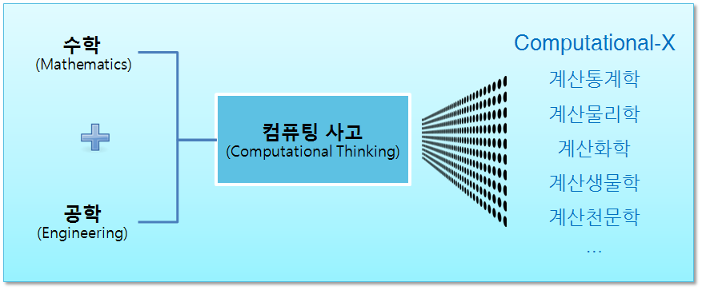

> ### 학습 목표 {.objectives}
>
> *  컴퓨팅 사고(Computational Thinking)를 이해한다.

### 1. 컴퓨팅 정의

컴퓨팅은 추상화를 자동화(Automation of Abstractions)하는 것이고 컴퓨팅 사고(Computational Thinking)는 수학과 마찬가지로 추상화 과정에 집중한다. 컴퓨팅 사고는 읽기(Reading), 쓰기(Writing), 셈하기(Arithmetic)와 더불어 향후 50년간 사람에게 꼭 필요한 능력이 될 것이다.

1. 올바른 추상화 선정
1. 동시에 다중 추상화 계층에 관해서 동작
1. 양파껍질 같은 계층 사이 관계를 정의

### 2. 컴퓨팅 사고에서 말하는 "훌륭한" 추상화 측도

- 효율성(Efficiency)
   - 시간 (time): 더 짧은 시간안에 수행
   - 공간 (space): 더 적은 공간을 차지하며 수행
   - 전력 (power): 더 적은 에너지를 소비하고 수행
- 정확도(Correctness)
    - 컴퓨터가 올바른 것을 수행하는가? 즉, 컴퓨터 프로그램이 정확한 정답을 산출하는가?
    - 컴퓨터 프로그램이 결국 정답을 산출할까? ([정지문제, Halting Problem](https://ko.wikipedia.org/wiki/정지_문제))
- 품질속성(Quality Attributes)
    - 단순함과 우아함
    - 사용편의성
    - 변경용이성
    - 유지보수성
    - 비용

### 3. 컴퓨팅 사고 추상화 개념 구성요소

- 복잡성: Computability, Intractability, Undecidability
- 알고리즘: 이진 검색, 문자열 매칭, 군집, 병합 정렬
- 자료구조: 수열, 표, 나무, 그래프, 네트웍
- 추상기계: 오토마타, (유한)상태기계 
- 아키텍처/디자인: 파이프-필드, 블랙보드, 계층, 위계 구조. 
- 언어: 정규표현식, VDM, Z, ML, 하스켈, 자바, 파이썬
- 로직과 의미론: Hoare Triples, temporal logic, modal logics, lambda calculus
- 휴리스틱스: A* (최적 우선 탐색 기법), 캐싱
- 제어 구조: 재귀, 반복, 병렬/순차 조합
- 통신: 동기/비동기, 방송/P2B, 클라이언트-서버, shared memory/message-passing
- 신뢰성, 저전력, 고장-방지(fault-tolerant) 등

> #### 컴퓨팅 사고에 포함되지 않는 것 {.callout}
>
> **컴퓨터 프로그래밍**과 **컴퓨터 유창성(Computer Literacy)**은 컴퓨팅 사고에 포함되지 않음.  
> 
> - 컴퓨팅 프로그래밍: 자바, C/C++, 파이썬, R, 스칼라 등  
> - 컴퓨터 유창성: 사무자동화 오피스, 인터넷 등

### 4. 컴퓨팅 사고 교육

컴퓨팅 사고를 컴퓨터를 처음 접하는 사람에게 어떻게 가르칠 것인지 아직 많은 연구와 실증적인 자료가 필요하다.

수학의 경우 숫자는 유치원, 대수는 중학교, 미적분은 고등학교에서 배우지만 컴퓨팅 사고 기본 개념은 언제 어떤 순서로 교육을 해야 하는가?

 - [CS Principles](http://csprinciples.org/)
 - [Computer Science Teachers Association](http://www.csta.acm.org)

- [참고: Jeannette M. Wing - Computational Thinking and Thinking About Computing](https://www.youtube.com/watch?v=C2Pq4N-iE4I)
- [참고: Jeannette M. Wing, "Computational Thinking", Communications of the ACM Viewpoint, Volume 49 Issue 3, March 2006 Pages 33-35](https://www.cs.cmu.edu/~15110-s13/Wing06-ct.pdf)
- [참고: Computational Thinking with Jeannette Wing](https://www.youtube.com/watch?v=U67utvZai8s)